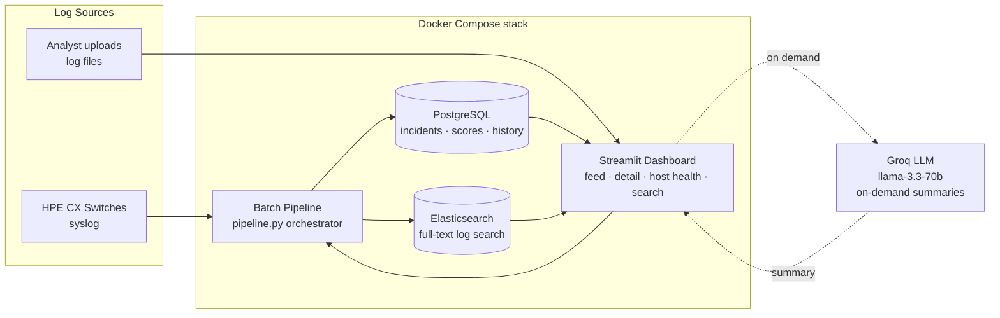
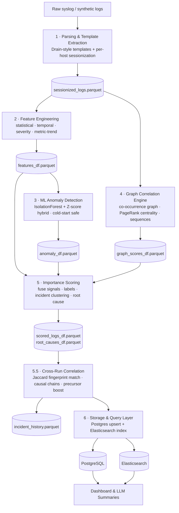
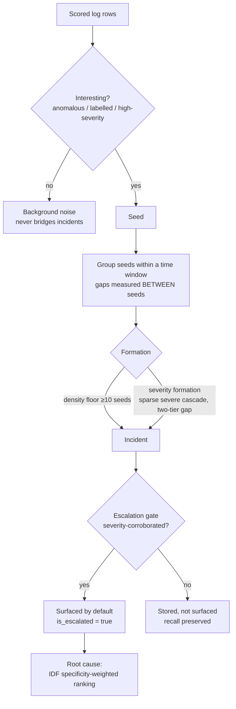
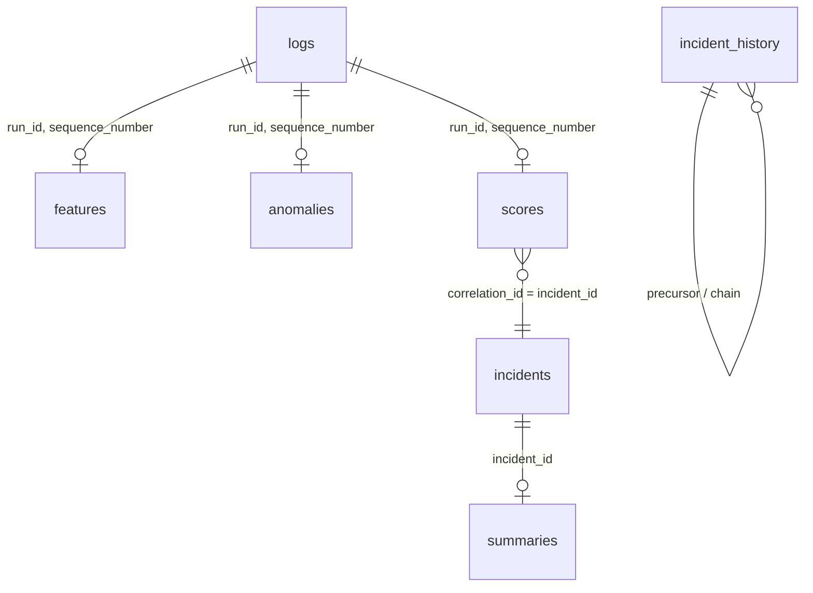

# Log Importance Scoring & Cross-Signal Correlation

> An unsupervised ML pipeline that turns a high-volume stream of network device
> syslog into a **short, ranked list of real incidents** — each with a root cause, a
> causal chain across days, and an on-demand LLM summary.

Built for **Hewlett Packard Enterprise**. The system ingests raw logs, detects
anomalies, groups related lines into **incidents**, ranks them by importance,
identifies the **root cause**, links incidents across days into **causal chains**,
and surfaces everything through an analyst-facing Streamlit dashboard.

---

## Table of Contents

- [The Problem](#the-problem)
- [What "Good" Means (Requirements)](#what-good-means-requirements)
- [System Architecture](#system-architecture)
- [Processing Pipeline](#processing-pipeline)
- [The Core Scoring Model](#the-core-scoring-model)
- [From Lines to Incidents](#from-lines-to-incidents)
- [Cross-Signal Correlation & Causal Chains](#cross-signal-correlation--causal-chains)
- [Performance Metrics](#performance-metrics)
- [Quickstart](#quickstart)
- [Module Overview](#module-overview)
- [Data Contracts](#data-contracts)
- [Configuration](#configuration)
- [The Dashboard](#the-dashboard)
- [Testing](#testing)
- [Where It's Weak & What's Next](#where-its-weak--whats-next)
- [Technology Stack](#technology-stack)
- [Team](#team)

---

## The Problem

**Log overload in network systems.** Switches and devices generate a continuous,
high-volume stream of syslog lines, and manual triage doesn't scale:

- 📊 **Massive volume** — logs are generated continuously by switches and devices.
- 🔇 **Mostly noise** — the majority of lines are routine, low-value heartbeats.
- 🔍 **Needle in a haystack** — genuine faults are <3 % of lines and are buried in the stream.
- 🏷️ **Severity tags lie in both directions** — benign lines tagged `CRITICAL`
  (a "ASIC temp 50C — NORMAL" heartbeat), real faults tagged `INFO` (an OOM cascade).
- 🔗 **An incident is a *group*** of correlated logs across time and hosts — not a single line.
- ⛓️ **No correlation** across logs and signals slows root-cause analysis; a fault
  today may be the *precursor* of an outage tomorrow.

---

## What "Good" Means (Requirements)

| Functional | Non-Functional |
|---|---|
| Ingest raw syslog (batch + analyst upload) | **Unsupervised** — no labelled fault data needed |
| Detect anomalies in log streams | **Explainable** — every score decomposes into named signals |
| Group related lines into **incidents** | **Robust** — cold-start safe, survives DB/LLM down |
| Rank by importance + identify **root cause** | **Reproducible** — fixed seeds, idempotent run IDs |
| Link incidents across days (**causal chains**) | **Adaptable** — onboard a new log source via config, not code |
| Analyst dashboard with on-demand summaries | **Zero false alarms on a clean day** |

---

## System Architecture

The system ships as a **Docker Compose** stack. The pipeline writes run-scoped state
to Postgres + Elasticsearch; the dashboard reads from both; LLM summaries are
generated **on demand from the dashboard**, never in the pipeline.



---

## Processing Pipeline

A **linear dataflow** — each stage reads the previous stage's output (a Parquet file
on disk, the "data contract"), enriches it, and writes its own. This makes every
stage independently runnable, testable, and restartable via `--from-step`.



> An optional **Evaluation** step runs between scoring and storage when ground-truth
> labels are present — it is an *oracle* harness only and **never** feeds the model.

### Stage responsibilities

| # | Stage | Responsibility | Key outputs |
|---|-------|----------------|-------------|
| 1 | **Parsing** | Drain-style `template_id` extraction, token normalization, `severity` assignment, per-host `session_id` grouping (gap / duration / size bounded). | `template_id`, `session_id`, `severity` |
| 2 | **Features** | Behavioural features: frequency, burstiness, rolling z-score baseline (Welford), inter-arrival rate, time deltas, counter-proximity, telemetry drop-rate/utilization + rolling OLS **slope** (the gradual-drift signal). | `frequency_score`, `burstiness_score`, `zscore_base`, `metric_slope_*` |
| 3 | **ML Anomaly Detection** | `StandardScaler → IsolationForest` (100 trees, seed 42) blended with a statistical z-score, weighted by a **cold-start confidence** factor. | `combined_score`, `is_anomaly`, `model_confidence` |
| 4 | **Graph Correlation** | Weighted co-occurrence graph of templates; PageRank / degree / betweenness centrality as a structural-importance signal; recurring ordered sequences. | `centrality_score`, `degree`, `in_sequence` |
| 5 | **Importance Scoring** | Fuse the three signals into one explainable `final_score`, map to labels, **cluster** into incidents, rank **root-cause** candidates. | `final_score`, `label`, `correlation_id`, `is_root_cause` |
| 5.5 | **Cross-Run Correlation** | Fingerprint each incident, match against 72h history via Jaccard similarity, assign **chain IDs**, and **boost** precursor scores when a later critical incident appears. | `chain_id`, `precursor_incident_id`, `chain_confidence` |
| 6 | **Storage** | Run-scoped upsert into Postgres (accumulating) + index into Elasticsearch for full-text search. | Postgres tables + ES index |

---

## The Core Scoring Model

Importance is an **explicit, weighted sum of three independent signals** — not a
single black-box score. Every number an analyst sees traces back to a named signal.

```
final_score =  0.50 · anomaly(ML)        (behavioural anomaly — unsupervised IsolationForest)
             + 0.25 · centrality(graph)  (structural importance — co-occurrence PageRank)
             + 0.25 · severity(rule)     (declared severity — rule)
```

**Why three separate terms?** Keeping severity as its own tunable term (instead of
feeding it into the IsolationForest) avoids two traps: (a) leaking the severity label
into an unsupervised model later *validated* against severity-derived ground truth,
and (b) double-counting severity. Two correction layers sit on top:

- **Severity credibility gate** — a line whose *message* asserts normalcy
  ("…NORMAL", "stable", "within bounds") cannot earn the severity bonus just because
  its *tag* says `CRITICAL`. It only ever **removes** an unearned bonus.
- **Severity fault promotion** — the inverse: a line whose *content* carries an
  unambiguous fault indicator ("out of memory", "split-brain", "threshold exceeded")
  is promoted to a credible high severity so it can seed an incident, even if tagged `INFO`.

---

## From Lines to Incidents

A raw anomaly score per line is noise; analysts act on **incidents**.



- **Anomaly-seeded temporal windowing** — only "interesting" rows become *seeds*;
  seeds within a time window form one incident. Continuous background noise can't
  bridge incidents because gaps are measured *between seeds*, not all logs.
- **Density floor + severity formation** — a dense burst of `medium` rows forms an
  incident (density), and so does a sparse-but-severe cascade (severity), using a
  two-tier gap so severe cascades stay whole while medium chains stay tight.
- **Escalation gate** — every incident is stored, but only severity-corroborated ones
  are flagged `is_escalated` and surfaced by default. It's a **ranking flag, not a
  filter** → real incidents separate from clean-day noise *without* dropping recall.
- **Root cause** — IDF specificity-weighted ranking, so rare fault templates beat
  ubiquitous heartbeats.

---

## Cross-Signal Correlation & Causal Chains

**Within a run — graph correlation**

- Build a weighted co-occurrence graph of log templates (events within a time window).
- **PageRank centrality** = a structural-importance signal feeding `final_score`.
- Detect recurring ordered sequences across sessions, e.g. `IF_DOWN → BGP_RESET → OSPF_LOST`.

**Across runs — causal chains**

- Fingerprint each incident by its template set; match against 72h history via
  **Jaccard similarity (≥ 0.3)**.
- Link matched incidents into **causal chains** across days — *"today's fault was
  yesterday's precursor."*
- **Boost precursor scores** when a later critical incident is discovered (retro-elevation).
- **Run-scoped storage keys** (`run_id`, `sequence_number`) so successive batches
  accumulate, never collide. `run_id` = `YYYYMMDD` of the batch's earliest event —
  deterministic from the data, so re-running the same batch is idempotent.

---

## Performance Metrics

**360° held-out evaluation** — 31,931 logs across 10 days (5 anomalous + 5 clean),
**model frozen** (true generalisation test):

| Metric | Result |
|---|---|
| **Escalated incident precision** (anomalous) | **1.00** — 5/5 real |
| **False escalations on 19,622 clean logs** | **0** ✅ |
| **Incident signal recall** | **0.857** |
| Ranking recall @ k | 0.76 |
| Signal-vs-noise score separation | 0.37 |
| Burst-scenario detection rate | 3/5 |

> **Takeaway:** reliable detection that generalises to unseen scenarios, with **zero
> clean-day alert fatigue** — the headline non-functional goal, met.

Reproduce with:

```bash
python scripts/run_360_eval.py
```

---

## Quickstart

```bash
# 1. Start infrastructure (Postgres, Elasticsearch)
docker compose up -d

# 2. Set up environment
cp .env.example .env          # fill in credentials (incl. GROQ_API_KEY for summaries)
python3 -m venv venv
source venv/bin/activate
pip install -r requirements.txt

# 3. Run the full pipeline (dry-run — skips Postgres write)
python pipeline.py --dry-run

# 4. Run with Postgres + Elasticsearch write (requires docker compose up)
python pipeline.py

# 5. Restart from a specific step (reads existing parquets for earlier steps)
python pipeline.py --dry-run --from-step scoring

# 6. Launch the dashboard
streamlit run dashboard/app.py     # or: docker compose up -d dashboard
```

If you have a real syslog file, pass it with `--log-file`:

```bash
python pipeline.py --dry-run --log-file data/raw/cx_switches.log
```

Without a log file, the pipeline generates synthetic CX switch data automatically.

> **Always run scripts from the project root** using the `-m` (module) flag to avoid
> import errors, e.g. `python3 -m storage.db_writer`.

---

## Module Overview

| Folder | Output file | Description |
|--------|-------------|-------------|
| `ingestion/` | `data/raw/*.log` | Raw log ingestion (batch loader or Fluent Bit stream) |
| `parsing/` | `data/processed/sessionized_logs.parquet` | Drain-style parsing + per-host sessionization |
| `features/` | `data/processed/features_df.parquet` | Statistical + temporal + severity + metric-trend features |
| `ml/` | `data/processed/anomaly_df.parquet` | IsolationForest + z-score hybrid anomaly detection |
| `correlation/` | `data/processed/graph_scores_df.parquet` | Co-occurrence graph, centrality scores, sequence detection |
| `scoring/` | `data/processed/scored_logs_df.parquet` | Final importance score, labels, incident clustering, root cause |
| `storage/` | Postgres / Elasticsearch | Persistence + full-text index |
| `dashboard/` | Streamlit UI | Incident feed, detail, host health, log search, upload & analyze |
| `evaluation/` | metrics report | Oracle-only held-out evaluation harness |
| `common/` | — | Shared config, logger, utils, schema definitions |
| `pipeline.py` | all of the above | End-to-end orchestrator (`--dry-run`, `--from-step`) |

All modules are **Done**. See [`docs/LLD.md`](docs/LLD.md) for per-module internals.

---

## Data Contracts

### `sessionized_logs.parquet` (canonical — all downstream modules read from this)

| Column | Type | Description |
|--------|------|-------------|
| `log_id` | str | Unique per-row identifier, e.g. `log_000001` |
| `raw_text` | str | Original unparsed log line |
| `timestamp` | datetime64 | UTC datetime |
| `source` | str | Hostname / device |
| `session_id` | str | Session group, e.g. `session_0001` |
| `template_id` | str | Drain template slug, e.g. `IF_DOWN` |
| `severity` | str | `CRITICAL` / `ERROR` / `WARN` / `INFO` |
| `is_anomaly` | bool | Set by anomaly detector; always `False` from parsing |
| `anomaly_label` | str | Non-empty only when `is_anomaly=True` |

### `anomaly_df.parquet`

`log_id` · `isolation_score` · `zscore_norm` · `combined_score` · `is_anomaly` · `model_confidence`

### `graph_scores_df.parquet`

`log_id` · `centrality_score` (PageRank, primary graph signal) · `degree` ·
`betweenness` · `cluster_id` · `in_sequence` · `correlated_log_ids`

### `scored_logs_df.parquet`

`log_id` · `final_score` · `label` · `correlation_id` (incident) · `is_root_cause` ·
`root_cause_confidence`

### Storage schema (PostgreSQL)



---

## Configuration

All tunables are centralized in `common/config.py`; dataset-specific vocabulary
(service aliases, noise labels) lives in YAML profiles under
`config/dataset_profiles/` — **onboarding a new log source needs no Python changes**.

Available profiles: `generic.yaml`, `hpe_synthetic.yaml`, `kubernetes_linux.yaml`.

Selected constants:

| Constant | Default | Description |
|---|---|---|
| `SCORING_ML_WEIGHT` | `0.50` | Weight of the ML anomaly signal in `final_score` |
| `SCORING_GRAPH_WEIGHT` | `0.25` | Weight of graph centrality |
| `SCORING_SEVERITY_WEIGHT` | `0.25` | Weight of declared severity |
| `IF_RANDOM_STATE` | `42` | IsolationForest seed (reproducibility) |
| `CORRELATION_TIME_WINDOW_SECONDS` | `60` | Co-occurrence window width |
| `PAGERANK_ALPHA` | `0.85` | PageRank damping factor |
| `SEQUENCE_MIN_LENGTH` / `SEQUENCE_MIN_SUPPORT` | `3` / `3` | Recurring-sequence detection bounds |
| `INCIDENT_MIN_SIZE` | `3` | Minimum seeds per incident (kills single-log incidents) |

**Environment / secrets** are accessed lazily and fail-fast via `common/config.py` —
never `os.getenv()` or `dotenv` directly. A missing variable exits cleanly with
`[ENV ERROR] Missing required variable: NAME` (no long traceback). Secrets are never
printed.

---

## The Dashboard

A Streamlit app that reads exclusively from Postgres + Elasticsearch (never from the
pipeline's in-memory state). Open **[http://localhost:8501](http://localhost:8501)**.

| Page | Purpose |
|------|---------|
| **Incident Feed** | Escalated incidents ranked by severity. *Clean days show nothing — that's the point.* |
| **Incident Detail** | Correlation graph, root-cause candidate + confidence, causal chain, and an **on-demand Groq LLM summary** (generated on first open, then cached in Postgres). |
| **Host Health** | Per-host activity and anomaly rates. |
| **Log Search** | Elasticsearch-backed full-text search with host / label / time filters and "Jump to incident". |
| **Upload & Analyze** | Analyst uploads a syslog file → triggers a pipeline run → surfaces only critical results. |

LLM summaries are generated **lazily from the dashboard**, so API spend tracks what
analysts actually open, not data volume.

---

## Testing

Per-module `tests/` packages run under `pytest`:

```bash
pytest                                         # everything
pytest correlation/tests/test_correlation.py -v   # 70 correlation unit tests
pytest ml/tests/test_anomaly.py
pytest scoring/tests/test_scoring.py -v
```

---

## Where It's Weak & What's Next

- **Severity is systematically under-tiered** — true `CRITICAL`s often land at
  `medium` (ML-weight ceiling). Detection is right; the label is one tier low.
- **Gradual drift** (memory leak, thermal creep) is harder to catch than bursts — detected 3/5.
- **Clean-only baseline beats mixed training** — a sharper decision boundary.

**Roadmap**

1. Cross-day clean baseline → stable, separable scores.
2. Re-tune the critical-tier threshold once scores are stable.
3. Dedicated drift-detection module for slow-slope faults.

---

## Technology Stack

| Layer | Technology |
|-------|-----------|
| Language | Python 3 |
| ML | scikit-learn (IsolationForest, StandardScaler), NumPy |
| Log parsing | Drain3-style template extraction |
| Graph | NetworkX |
| Data | pandas + Parquet |
| Storage | PostgreSQL 15, Elasticsearch 8.11 |
| Dashboard | Streamlit + vis-network |
| LLM | Groq API (`llama-3.3-70b-versatile`) |
| Ingestion | Batch loader + Fluent Bit config |
| Orchestration | `pipeline.py` + Docker Compose |

---

## Team

Shreeraksha M · Sumukha Rao H · Ujwal Hegde · Sharva Dhanvi V · Vishon Dsouza
